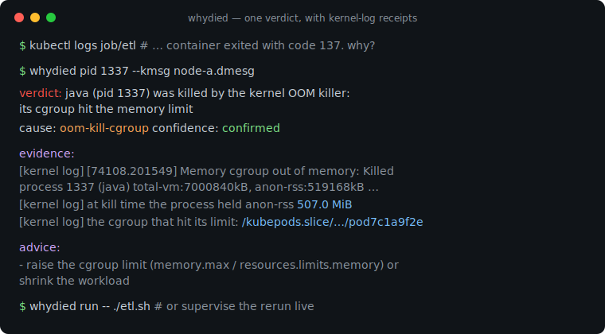
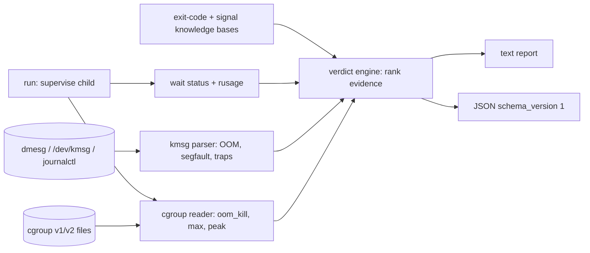

# whydied

[English](README.md) | [中文](README.zh.md) | [日本語](README.ja.md)

[](LICENSE) [](go.mod) [](CHANGELOG.md)  [](CONTRIBUTING.md)

**whydied：プロセスがなぜ死んだのかを説明する、オープンソースかつ依存ゼロの CLI——終了コード、シグナル、OOM キル、cgroup の証拠を、カーネルログに裏付けられた一つの判定に統合する。**



```bash
git clone https://github.com/JaydenCJ/whydied && cd whydied
go build -o whydied ./cmd/whydied    # single static binary, stdlib only
```

> プレリリース：v0.1.0 はまだどのパッケージレジストリにも公開されていません。上記の手順でソースからビルドしてください（Go ≥1.22 なら可）。

## なぜ whydied？

「Exited with code 137」は毎日何千人もの人を検索エンジンへ送り込みますが、見つかるのは散在する言い伝えだけです：あるページには終了コード対照表、別のページには `dmesg | grep -i oom` という呪文、さらに「OOM キラーの犠牲者は必ずしも割り当てたプロセスではない」という注意書き——それでも*自分の* 137 がカーネルの仕業なのか、運用者の `kill -9` なのか、アプリが本当に `exit(137)` を呼んだのかを見分ける手段はありません。whydied はその言い伝えを、証拠に裏付けられた一つの診断ツールへ統合します。各種の慣習（POSIX の 126/127/128+N、BSD sysexits 全 15 個、docker の 125、ssh の 255、CRLF shebang が 127 を生む罠）を知り、カーネル自身の死亡記録——メモリ集計と memcg パス付きの OOM キル、x86 エラーコードのビットを解読したセグフォルト、致命的トラップ——を dmesg、`/dev/kmsg`、journalctl、保存済みログから解析し、cgroup v1/v2 のメモリカウンタも読み取ります。そのうえで、明示的な確信度と根拠を添えた一つの判定を出力します。*confirmed*（カーネル記録があなたの PID を名指し）と *possible*（ログの参照できない裸の 137）の差こそが、言い伝えが失っている情報だからです。

| | whydied | `dmesg \| grep oom` | 終了コード早見表 | `docker inspect` / `kubectl describe` |
|---|---|---|---|---|
| 確信度付きの単一の判定 | ✅ confirmed/likely/possible | ❌ 生のログ行 | ❌ 汎用的な表の行 | ⚠️ `OOMKilled` のブール値のみ |
| カーネルログの証拠を添付 | ✅ 解析＋引用 | ⚠️ 自分で解釈 | ❌ | ❌ |
| cgroup 上限とホスト OOM を区別 | ✅ constraint + memcg パス | ⚠️ フィールドを知っていれば | ❌ | ❌ |
| セグフォルト/トラップ解読（エラーコードのビット） | ✅ | ❌ | ❌ | ❌ |
| ライブ監督（`run` ラッパー、カウンタ差分） | ✅ | ❌ | ❌ | ❌ |
| 他マシンの保存済みログを解析可能 | ✅ `--kmsg file` | ⚠️ 手作業 | — | ❌ |
| ランタイム依存 | 0（静的バイナリ 1 個） | シェルの言い伝え | ブラウザ | docker/k8s 一式 |

<sub>2026-07-13 確認：whydied は Go 標準ライブラリのみを import。`docker inspect` の `.State.OOMKilled` は証拠のないブール値。Kubernetes の `OOMKilled` は pod レコードが残っている間しか見えません。</sub>

## 特徴

- **正直な 137 デコーダ** — `whydied 137` は 128+N 慣習を説明し、OOM キラー（サーバでの原因第 1 位）を先頭に挙げ、必ず但し書きを添えます：裸の終了コードは報告であって証拠ではない——そして証拠を得るための 2 つのコマンドを提示します。
- **カーネルログ検死** — `pid` と `scan` は OOM キル（グローバル*と* cgroup 制約、新旧両方の文言）、memcg パス付き `oom-kill:constraint=` サマリ行、セグフォルト、致命的トラップを解析。入力は dmesg、`/dev/kmsg`、journalctl、任意の保存済みキャプチャ。
- **透過的な監督** — `whydied run -- cmd` は stdio と終了コードをそのまま素通しし（シグナル死は 128+シグナル）、成功時は沈黙。死亡時には*本物の* wait ステータス、ピーク RSS、cgroup `oom_kill` カウンタの差分を観測——事後の grep では決して回収できない証拠です。
- **cgroup に精通** — v2 の `memory.events`/`max`/`peak` と v1 の `oom_control`/`limit_in_bytes` を読み、「無制限」の番兵値を正規化し、「ピークが上限に張り付いている」を状況証拠として正当に評価します。
- **信頼できる確信度** — すべての判定は confirmed、likely、possible、info のいずれか。各ルールには*発火してはならない*ケースのテストがあり、決して言い過ぎません。
- **依存ゼロ、完全オフライン** — Go 標準ライブラリのみ、静的バイナリ 1 個、ネットワーク呼び出しなし、テレメトリなし、同一入力にはバイト単位で同一の出力；`--json` は安定した `schema_version: 1` エンベロープを提供。

## クイックスタート

```bash
whydied 137          # the question everyone has
```

実際にキャプチャした出力（冒頭数行）：

```text
exit code 137 (SIGKILL): usually: killed by SIGKILL (128+9, unconditional kill: cannot be caught or ignored)
class: fatal-signal

what it usually means:
  - shells and most runtimes report "died of signal 9" as exit code 128+9 = 137
  - the kernel OOM killer (check the kernel log — this is the #1 cause on servers)
  - an explicit `kill -9`, or a container runtime enforcing a memory/timeout limit
```

次は「usually」を証拠に置き換えます——カーネルログで PID を検死（リポジトリに現実的なキャプチャを同梱）：

```bash
whydied pid 1337 --kmsg examples/kern.log
```

```text
verdict: java (pid 1337) was killed by the kernel OOM killer: its cgroup hit the memory limit
cause: oom-kill-cgroup   confidence: confirmed

evidence:
  [kernel log] [74108.201549] Memory cgroup out of memory: Killed process 1337 (java) total-vm:7000840kB, anon-rss:519168kB, file-rss:3072kB, shmem-rss:0kB, UID:0 pgtables:1437kB oom_score_adj:979
  [kernel log] at kill time the process held anon-rss 507.0 MiB, total-vm 6.7 GiB
  [kernel log] oom_score_adj was 979 — victim selection was biased
  [kernel log] the cgroup that hit its limit: /kubepods.slice/kubepods-burstable.slice/pod7c1a9f2e (constraint CONSTRAINT_MEMCG)

advice:
  - raise the cgroup limit (cgroup v2 memory.max; Kubernetes resources.limits.memory; docker --memory) or shrink the workload
  - compare memory.peak against memory.max over time — a slow climb to the limit means a leak, an instant hit means undersizing
  - in Kubernetes this surfaces as OOMKilled / exit code 137 in `kubectl describe pod`
```

あるいは次の実行をライブで監督——`whydied run` は任意のコマンドを透過的にラップし、その場で診断します：

```bash
whydied run -- ./flaky-job.sh    # child stdio + exit code pass through; verdict on stderr
```

## コマンドとフラグ

`whydied [code|signal|run|pid|scan|version]` —— 裸の数字は `code` のショートカット。終了コード：0 正常、2 用法エラー、3 実行時エラー；`run` は子プロセスのステータスを素通しします。

| フラグ | デフォルト | 効果 |
|---|---|---|
| `--json` | オフ | 機械可読出力（`schema_version: 1` エンベロープ） |
| `--kmsg <file>` | `/dev/kmsg` | カーネルログをファイルから読む；`-` は stdin（`dmesg \| whydied scan --kmsg -`） |
| `--cgroup <dir>`（pid/run） | run：自身の cgroup | 証拠を読み取るメモリ cgroup ディレクトリ |
| `code <n>` | — | 終了コード（0–255）を説明 |
| `signal <name\|n>` | — | シグナルを説明（`SIGKILL`、`kill`、`9`、`SIGRTMIN+2`） |
| `pid <pid>` | — | カーネルログ + cgroup カウンタで PID を検死 |
| `scan` | — | カーネルログに記録された死亡をすべて列挙 |
| `run -- <cmd>…` | — | コマンドを監督し、その死を診断 |

証拠フォーマット、セグフォルトのエラーコードビット、確信度ルール：[docs/evidence.md](docs/evidence.md)。

## 検証

このリポジトリは CI を同梱しません。上記の主張はすべてローカル実行で検証されています：

```bash
go test ./...            # 93 deterministic tests, offline, < 5 s
bash scripts/smoke.sh    # end-to-end CLI check, prints SMOKE OK
```

## アーキテクチャ



## ロードマップ

- [x] v0.1.0 —— 終了コード/シグナル知識ベース、カーネルログパーサ（OOM/セグフォルト/トラップ、4 種のラッピング）、cgroup v1+v2 証拠、確信度付き判定エンジン、透過的 `run` 監督、JSON エンベロープ、93 テスト + スモークスクリプト
- [ ] `scan --since` / 長大なログ向けのブート相対タイムスタンプフィルタ
- [ ] core dump 認識：判定のために coredumpctl エントリを特定・要約
- [ ] PID が再利用された検死向けの `pid --comm` マッチング
- [ ] Windows/macOS 層：可能な範囲で wait ステータスと Job Object / Jetsam 証拠を解読
- [ ] 停止した（死んでいない）プロセスの判定：cgroup freezer、SIGSTOP、デバッガ検出

全リストは [open issues](https://github.com/JaydenCJ/whydied/issues) を参照。

## コントリビュート

Issue・ディスカッション・PR を歓迎します——ローカルワークフロー（フォーマット、vet、テスト、`SMOKE OK`）は [CONTRIBUTING.md](CONTRIBUTING.md) を参照。入門タスクは [good first issue](https://github.com/JaydenCJ/whydied/issues?q=is%3Aissue+is%3Aopen+label%3A%22good+first+issue%22) のラベル付き、設計の議論は [Discussions](https://github.com/JaydenCJ/whydied/discussions) で。

## ライセンス

[MIT](LICENSE)
