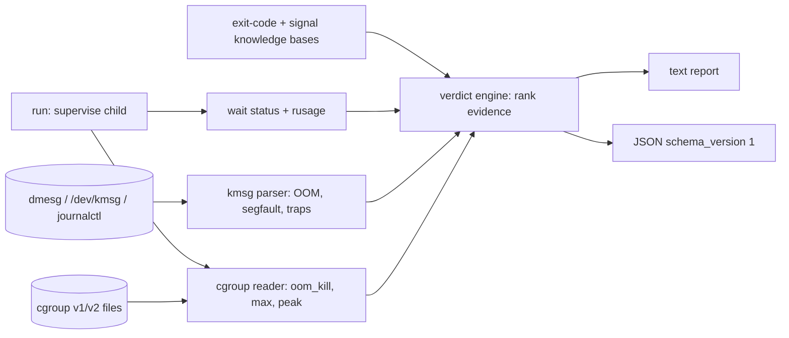

# whydied

[English](README.md) | [中文](README.zh.md) | [日本語](README.ja.md)

[](LICENSE) [](go.mod) [](CHANGELOG.md)  [](CONTRIBUTING.md)

**whydied：an open-source, zero-dependency CLI that explains why a process died — exit codes, signals, OOM kills, and cgroup evidence, unified into one kernel-log-backed verdict.**


```bash
git clone https://github.com/JaydenCJ/whydied && cd whydied
go build -o whydied ./cmd/whydied    # single static binary, stdlib only
```

> Pre-release: v0.1.0 is not tagged on a package registry yet; build from source as above (any Go ≥1.22).

## Why whydied?

"Exited with code 137" sends thousands of people to a search engine every day, and what they find is scattered folklore: an exit-code table on one page, a `dmesg | grep -i oom` incantation on another, a warning that the OOM killer's victim is not always the process that allocated, and no way to tell whether *their* 137 was the kernel, an operator's `kill -9`, or an app that literally called `exit(137)`. whydied unifies that folklore into one evidence-backed diagnosis tool. It knows the conventions (POSIX 126/127/128+N, all 15 BSD sysexits, docker's 125, ssh's 255, the CRLF-shebang 127 trap), parses the kernel's own death records — OOM kills with their memory accounting and memcg paths, segfaults with the x86 error-code bits decoded, fatal traps — from dmesg, `/dev/kmsg`, journalctl, or a saved log file, and reads cgroup v1/v2 memory counters. Then it renders one verdict with an explicit confidence tier and the receipts, because the difference between *confirmed* (a kernel record names your PID) and *possible* (a bare 137 with no log access) is exactly the difference that folklore loses.

| | whydied | `dmesg \| grep oom` | exit-code cheat sheets | `docker inspect` / `kubectl describe` |
|---|---|---|---|---|
| One verdict with confidence tier | ✅ confirmed/likely/possible | ❌ raw lines | ❌ generic table rows | ⚠️ a single `OOMKilled` bool |
| Kernel-log evidence attached | ✅ parsed + quoted | ⚠️ you interpret it | ❌ | ❌ |
| Distinguishes cgroup limit vs host OOM | ✅ constraint + memcg path | ⚠️ if you know the fields | ❌ | ❌ |
| Segfault/trap decoding (error-code bits) | ✅ | ❌ | ❌ | ❌ |
| Live supervision (`run` wrapper, counter deltas) | ✅ | ❌ | ❌ | ❌ |
| Works on saved logs from another machine | ✅ `--kmsg file` | ⚠️ manual | — | ❌ |
| Runtime dependencies | 0 (one static binary) | shell folklore | a browser | docker/k8s stack |

<sub>Checked 2026-07-13: whydied imports the Go standard library only; `docker inspect` exposes `.State.OOMKilled` as a boolean with no evidence; Kubernetes shows `OOMKilled` only while the pod record lives.</sub>

## Features

- **The 137 decoder, done honestly** — `whydied 137` explains the 128+N convention, leads with the OOM killer (the #1 cause on servers), and always states the caveat: a bare exit code is a report, not proof — then shows you the two commands that produce proof.
- **Kernel-log post-mortem** — `pid` and `scan` parse OOM kills (global *and* cgroup-constrained, modern and pre-4.19 wordings), `oom-kill:constraint=` summaries with memcg paths, segfaults, and fatal traps from dmesg, `/dev/kmsg`, journalctl, or any saved capture.
- **Transparent supervision** — `whydied run -- cmd` passes stdio and the exit code through untouched (128+signal for signal deaths), stays silent on success, and on death observes the *real* wait status, peak RSS, and the cgroup `oom_kill` counter delta — evidence no after-the-fact grep can recover.
- **cgroup fluency** — reads v2 `memory.events`/`max`/`peak` and v1 `oom_control`/`limit_in_bytes`, normalizes the no-limit sentinels, and grades "peak pinned at the limit" as the circumstantial evidence it is.
- **Confidence you can trust** — every verdict is confirmed, likely, possible, or info; the engine is tested for the cases where each rule must *not* fire, so it never overclaims.
- **Zero dependencies, fully offline** — Go standard library only, one static binary, no network calls, no telemetry, byte-identical output for identical input; `--json` ships a stable `schema_version: 1` envelope.

## Quickstart

```bash
whydied 137          # the question everyone has
```

Real captured output (first lines):

```text
exit code 137 (SIGKILL): usually: killed by SIGKILL (128+9, unconditional kill: cannot be caught or ignored)
class: fatal-signal

what it usually means:
  - shells and most runtimes report "died of signal 9" as exit code 128+9 = 137
  - the kernel OOM killer (check the kernel log — this is the #1 cause on servers)
  - an explicit `kill -9`, or a container runtime enforcing a memory/timeout limit
```

Now get evidence instead of "usually" — post-mortem a PID against a kernel log (the repo ships a realistic capture):

```bash
whydied pid 1337 --kmsg examples/kern.log
```

```text
verdict: java (pid 1337) was killed by the kernel OOM killer: its cgroup hit the memory limit
cause: oom-kill-cgroup   confidence: confirmed

evidence:
  [kernel log] [74108.201549] Memory cgroup out of memory: Killed process 1337 (java) total-vm:7000840kB, anon-rss:519168kB, file-rss:3072kB, shmem-rss:0kB, UID:0 pgtables:1437kB oom_score_adj:979
  [kernel log] at kill time the process held anon-rss 507.0 MiB, total-vm 6.7 GiB
  [kernel log] oom_score_adj was 979 — victim selection was biased
  [kernel log] the cgroup that hit its limit: /kubepods.slice/kubepods-burstable.slice/pod7c1a9f2e (constraint CONSTRAINT_MEMCG)

advice:
  - raise the cgroup limit (cgroup v2 memory.max; Kubernetes resources.limits.memory; docker --memory) or shrink the workload
  - compare memory.peak against memory.max over time — a slow climb to the limit means a leak, an instant hit means undersizing
  - in Kubernetes this surfaces as OOMKilled / exit code 137 in `kubectl describe pod`
```

Or supervise the next run live — `whydied run` wraps any command transparently and diagnoses on the spot:

```bash
whydied run -- ./flaky-job.sh    # child stdio + exit code pass through; verdict on stderr
```

## Commands and flags

`whydied [code|signal|run|pid|scan|version]` — a bare number is a shortcut for `code`. Exit codes: 0 ok, 2 usage error, 3 runtime error; `run` passes the child's status through instead.

| Flag | Default | Effect |
|---|---|---|
| `--json` | off | machine-readable output (`schema_version: 1` envelope) |
| `--kmsg <file>` | `/dev/kmsg` | read the kernel log from a file; `-` reads stdin (`dmesg \| whydied scan --kmsg -`) |
| `--cgroup <dir>` (pid/run) | run: own cgroup | memory-cgroup directory to read evidence from |
| `code <n>` | — | explain an exit code, 0–255 |
| `signal <name\|n>` | — | explain a signal (`SIGKILL`, `kill`, `9`, `SIGRTMIN+2`) |
| `pid <pid>` | — | post-mortem one PID against kernel log + cgroup counters |
| `scan` | — | list every death recorded in the kernel log |
| `run -- <cmd>…` | — | supervise a command and diagnose its death |

Evidence formats, segfault error-code bits, and the confidence-tier rules: [docs/evidence.md](docs/evidence.md).

## Verification

This repository ships no CI; every claim above is verified by local runs:

```bash
go test ./...            # 93 deterministic tests, offline, < 5 s
bash scripts/smoke.sh    # end-to-end CLI check, prints SMOKE OK
```

## Architecture



## Roadmap

- [x] v0.1.0 — exit-code/signal knowledge bases, kernel-log parser (OOM/segfault/traps, four wrappings), cgroup v1+v2 evidence, confidence-tiered verdict engine, transparent `run` supervisor, JSON envelope, 93 tests + smoke script
- [ ] `scan --since` / boot-relative timestamp filtering for long logs
- [ ] Core-dump awareness: locate and summarize coredumpctl entries for the verdict
- [ ] `pid --comm` matching for post-mortems where the PID has been recycled
- [ ] Windows/macOS tier: decode wait statuses and Job Object / Jetsam evidence where available
- [ ] Verdicts for stopped (not dead) processes: cgroup freezer, SIGSTOP, debugger detection

See the [open issues](https://github.com/JaydenCJ/whydied/issues) for the full list.

## Contributing

Issues, discussions and pull requests are welcome — see [CONTRIBUTING.md](CONTRIBUTING.md) for the local workflow (format, vet, tests, `SMOKE OK`). Good entry points are labelled [good first issue](https://github.com/JaydenCJ/whydied/issues?q=is%3Aissue+is%3Aopen+label%3A%22good+first+issue%22), and design questions live in [Discussions](https://github.com/JaydenCJ/whydied/discussions).

## License

[MIT](LICENSE)
