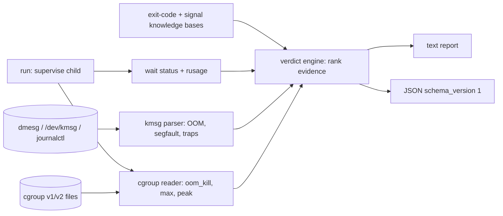

# whydied

[English](README.md) | [中文](README.zh.md) | [日本語](README.ja.md)

[](LICENSE) [](go.mod) [](CHANGELOG.md)  [](CONTRIBUTING.md)

**whydied：开源、零依赖的 CLI，解释进程为什么死了——退出码、信号、OOM 击杀、cgroup 证据，统一成一份有内核日志背书的裁决。**


```bash
git clone https://github.com/JaydenCJ/whydied && cd whydied
go build -o whydied ./cmd/whydied    # single static binary, stdlib only
```

> 预发布：v0.1.0 尚未发布到任何包仓库；请按上述方式从源码构建（任意 Go ≥1.22）。

## 为什么选 whydied？

"Exited with code 137" 每天把成千上万的人送进搜索引擎，而他们找到的只是散落的民间传说：这页有一张退出码对照表，那页有一句 `dmesg | grep -i oom` 咒语，还有人提醒 OOM 杀手的受害者并不总是那个分配内存的进程，却没有任何办法判断*自己的* 137 究竟是内核所为、运维的 `kill -9`，还是应用真的调用了 `exit(137)`。whydied 把这些民间传说统一成一个证据背书的诊断工具。它熟知各种约定（POSIX 的 126/127/128+N、全部 15 个 BSD sysexits、docker 的 125、ssh 的 255、CRLF shebang 导致 127 的陷阱），能从 dmesg、`/dev/kmsg`、journalctl 或保存的日志文件中解析内核自己的死亡记录——带内存核算与 memcg 路径的 OOM 击杀、解码了 x86 错误码位的段错误、致命陷阱——还会读取 cgroup v1/v2 的内存计数器。然后它输出一份裁决，带明确的置信等级和全部凭据，因为 *confirmed*（内核记录点名了你的 PID）与 *possible*（一个没有日志可查的裸 137）之间的差别，恰恰是民间传说丢掉的那部分。

| | whydied | `dmesg \| grep oom` | 退出码速查表 | `docker inspect` / `kubectl describe` |
|---|---|---|---|---|
| 一份带置信等级的裁决 | ✅ confirmed/likely/possible | ❌ 原始日志行 | ❌ 泛泛的表格行 | ⚠️ 一个 `OOMKilled` 布尔值 |
| 附带内核日志证据 | ✅ 已解析并引用 | ⚠️ 得自己解读 | ❌ | ❌ |
| 区分 cgroup 限额与主机 OOM | ✅ constraint + memcg 路径 | ⚠️ 需要认识那些字段 | ❌ | ❌ |
| 段错误/陷阱解码（错误码位） | ✅ | ❌ | ❌ | ❌ |
| 现场监督（`run` 包装器、计数器差值） | ✅ | ❌ | ❌ | ❌ |
| 可分析来自其它机器的日志 | ✅ `--kmsg file` | ⚠️ 手工操作 | — | ❌ |
| 运行时依赖 | 0（单个静态二进制） | shell 民间传说 | 一个浏览器 | docker/k8s 全家桶 |

<sub>核查于 2026-07-13：whydied 只导入 Go 标准库；`docker inspect` 的 `.State.OOMKilled` 只是一个没有证据的布尔值；Kubernetes 的 `OOMKilled` 只在 pod 记录存续期间可见。</sub>

## 特性

- **诚实的 137 解码器** — `whydied 137` 讲清 128+N 约定，把 OOM 杀手放在第一位（服务器上的头号原因），并始终声明前提：裸退出码只是报告、不是证据——然后告诉你哪两条命令能拿到证据。
- **内核日志验尸** — `pid` 与 `scan` 解析 OOM 击杀（全局*和* cgroup 受限、新旧两种措辞）、带 memcg 路径的 `oom-kill:constraint=` 摘要行、段错误与致命陷阱，来源可以是 dmesg、`/dev/kmsg`、journalctl 或任何保存下来的抓取。
- **透明监督** — `whydied run -- cmd` 原样透传 stdio 和退出码（信号死亡为 128+信号），成功时保持沉默；死亡时观测*真实的* wait 状态、峰值 RSS 和 cgroup `oom_kill` 计数器差值——这些证据事后 grep 无从恢复。
- **精通 cgroup** — 读取 v2 的 `memory.events`/`max`/`peak` 与 v1 的 `oom_control`/`limit_in_bytes`，归一化各种"无限制"哨兵值，并把"峰值顶死在限额上"如实评为旁证。
- **可信赖的置信度** — 每份裁决都是 confirmed、likely、possible 或 info；引擎对每条规则都测试了*不该*触发的情形，因此从不夸大结论。
- **零依赖、完全离线** — 只用 Go 标准库，单个静态二进制，无网络调用，无遥测，相同输入产生逐字节相同的输出；`--json` 提供稳定的 `schema_version: 1` 信封。

## 快速上手

```bash
whydied 137          # the question everyone has
```

真实抓取的输出（前几行）：

```text
exit code 137 (SIGKILL): usually: killed by SIGKILL (128+9, unconditional kill: cannot be caught or ignored)
class: fatal-signal

what it usually means:
  - shells and most runtimes report "died of signal 9" as exit code 128+9 = 137
  - the kernel OOM killer (check the kernel log — this is the #1 cause on servers)
  - an explicit `kill -9`, or a container runtime enforcing a memory/timeout limit
```

现在用证据取代"usually"——拿内核日志给一个 PID 验尸（仓库自带一份真实感抓取）：

```bash
whydied pid 1337 --kmsg examples/kern.log
```

```text
verdict: java (pid 1337) was killed by the kernel OOM killer: its cgroup hit the memory limit
cause: oom-kill-cgroup   confidence: confirmed

evidence:
  [kernel log] [74108.201549] Memory cgroup out of memory: Killed process 1337 (java) total-vm:7000840kB, anon-rss:519168kB, file-rss:3072kB, shmem-rss:0kB, UID:0 pgtables:1437kB oom_score_adj:979
  [kernel log] at kill time the process held anon-rss 507.0 MiB, total-vm 6.7 GiB
  [kernel log] oom_score_adj was 979 — victim selection was biased
  [kernel log] the cgroup that hit its limit: /kubepods.slice/kubepods-burstable.slice/pod7c1a9f2e (constraint CONSTRAINT_MEMCG)

advice:
  - raise the cgroup limit (cgroup v2 memory.max; Kubernetes resources.limits.memory; docker --memory) or shrink the workload
  - compare memory.peak against memory.max over time — a slow climb to the limit means a leak, an instant hit means undersizing
  - in Kubernetes this surfaces as OOMKilled / exit code 137 in `kubectl describe pod`
```

或者现场监督下一次运行——`whydied run` 透明包装任意命令并当场诊断：

```bash
whydied run -- ./flaky-job.sh    # child stdio + exit code pass through; verdict on stderr
```

## 命令与旗标

`whydied [code|signal|run|pid|scan|version]` —— 裸数字是 `code` 的捷径。退出码：0 正常、2 用法错误、3 运行时错误；`run` 则透传子进程的状态。

| 旗标 | 默认值 | 作用 |
|---|---|---|
| `--json` | 关 | 机器可读输出（`schema_version: 1` 信封） |
| `--kmsg <file>` | `/dev/kmsg` | 从文件读取内核日志；`-` 读 stdin（`dmesg \| whydied scan --kmsg -`） |
| `--cgroup <dir>`（pid/run） | run：自身 cgroup | 读取证据的内存 cgroup 目录 |
| `code <n>` | — | 解释一个退出码，0–255 |
| `signal <name\|n>` | — | 解释一个信号（`SIGKILL`、`kill`、`9`、`SIGRTMIN+2`） |
| `pid <pid>` | — | 用内核日志 + cgroup 计数器给一个 PID 验尸 |
| `scan` | — | 列出内核日志里记录的每一次死亡 |
| `run -- <cmd>…` | — | 监督一条命令并诊断其死亡 |

证据格式、段错误错误码位、置信等级规则：[docs/evidence.md](docs/evidence.md)。

## 验证

本仓库不附带 CI；上述每一条声明都由本地运行验证：

```bash
go test ./...            # 93 deterministic tests, offline, < 5 s
bash scripts/smoke.sh    # end-to-end CLI check, prints SMOKE OK
```

## 架构



## 路线图

- [x] v0.1.0 —— 退出码/信号知识库、内核日志解析器（OOM/段错误/陷阱，四种包装格式）、cgroup v1+v2 证据、置信分级裁决引擎、透明 `run` 监督器、JSON 信封、93 个测试 + 冒烟脚本
- [ ] `scan --since` / 面向长日志的开机相对时间戳过滤
- [ ] 感知 core dump：为裁决定位并汇总 coredumpctl 条目
- [ ] `pid --comm` 匹配，应对 PID 已被复用的验尸场景
- [ ] Windows/macOS 层级：在可行处解码 wait 状态与 Job Object / Jetsam 证据
- [ ] 针对被停止（而非死亡）进程的裁决：cgroup freezer、SIGSTOP、调试器检测

完整列表见 [open issues](https://github.com/JaydenCJ/whydied/issues)。

## 参与贡献

欢迎 issue、讨论与 PR——本地工作流（格式化、vet、测试、`SMOKE OK`）见 [CONTRIBUTING.md](CONTRIBUTING.md)。入门任务标记为 [good first issue](https://github.com/JaydenCJ/whydied/issues?q=is%3Aissue+is%3Aopen+label%3A%22good+first+issue%22)，设计讨论在 [Discussions](https://github.com/JaydenCJ/whydied/discussions)。

## 许可证

[MIT](LICENSE)
